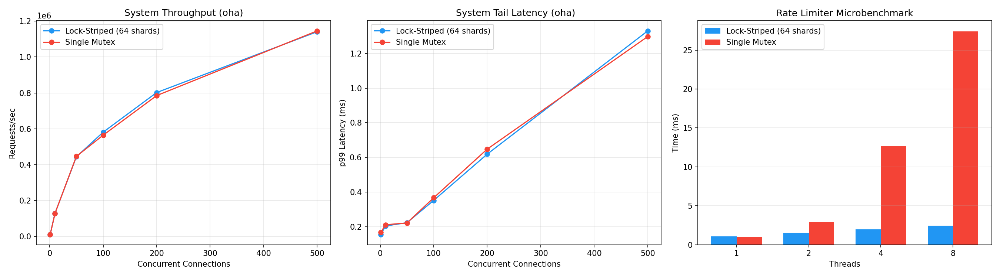

# Traffic Warden

A lightweight, high-performance, and thread-safe HTTP reverse proxy built in Rust.

Traffic Warden acts as a defensive layer for upstream services, implementing a concurrent **Token Bucket** rate limiter, **lock-free round-robin load balancing**, **active health checking with automatic failover**, and automated memory management. It is designed to handle high-throughput traffic without succumbing to data races, socket exhaustion, or out-of-memory (OOM) leaks.

## Architecture & Workspace

This project is structured as a Cargo Workspace containing two distinct services:

1. **`proxy`**: The core reverse proxy service. Internally modularized to decouple state management, HTTP handlers, and background workers, utilizing Axum and Tokio for high-concurrency routing.
2. **`upstream_mock`**: A lightweight multi-node HTTP backend that spawns 3 servers (ports 8080, 8081, 8082) to simulate a cluster and validate proxy forwarding and load distribution.

## Key Features

* **Lock-Free Round-Robin Load Balancing:** Distributes requests across a pool of **healthy** upstream servers using an `AtomicUsize` counter with `Ordering::Relaxed`, achieving zero-contention scheduling without any mutex overhead on the hot path.
* **Active Health Checking & Automatic Failover:** A background `tokio::spawn` task pings every upstream every 10 seconds with a 2-second timeout. The healthy upstream list is maintained behind an `Arc<RwLock<Vec<String>>>`, allowing readers (request handlers) to proceed concurrently while the health checker holds a brief write lock to swap in the updated list. If all upstreams are down, the proxy immediately returns `502 Bad Gateway`.
* **Thread-Safe State Management via Lock Striping:** Tracks concurrent client IPs and token balances using a custom sharded concurrent map (`Arc<[Mutex<HashMap>; 64]>`). Incoming requests are deterministically hashed and routed to specific shards, allowing true multi-core concurrent processing.
* **Token Bucket Traffic Shaping:** Replaces naive fixed time-windows with a continuous Token Bucket algorithm using precise time-delta calculations (`f32`). This completely mitigates boundary-burst exploits.
* **Asynchronous Garbage Collection:** A detached `tokio::spawn` background worker wakes up periodically to sweep expired IP allocations. It iterates through the 64 shards sequentially, locking and cleaning one at a time to prevent global blocking and maintain a stable RAM footprint.
* **Connection Pooling:** Reuses a single `reqwest::Client` internal pool to prevent ephemeral TCP socket exhaustion under heavy load.
* **Asynchronous HTTP Body Streaming:** Replaces naive in-memory payload buffering with chunk-by-chunk byte streaming using `http-util-body` and the `reqwest` stream feature. This provides true non-blocking Network I/O, allowing the proxy to route gigabytes of data with a completely flat, near-zero memory footprint, natively eliminating Out-Of-Memory (OOM) vulnerabilities.

## Performance

All benchmarks were run on Intel Core i7-14700KF, 3400 MHz, 20 Cores running Ubuntu 24.04 on WSL2 with Rust 1.94.0 stable (release mode).

### System Throughput (oha)

End-to-end benchmarks using [oha](https://github.com/hatoo/oha) against the full proxy with 3 upstream mock servers. Rate limiting disabled via the `bench` feature flag.

Both lock-striped and single-mutex designs achieve comparable system throughput (~1.1M req/s at 500 connections) because the network round-trip to upstream servers dominates lock hold time at this layer.

### Rate Limiter Microbenchmark (Criterion)

To isolate the rate-limiting hot path from network I/O, a [Criterion](https://github.com/bheisler/criterion.rs) microbenchmark calls `check_rate_limit()` directly from multiple threads (10,000 unique IPs per thread).

At 8 threads, the 64-shard lock-striped design completes in ~3ms compared to ~25ms for a single mutex — an **~8x improvement** — confirming that lock striping eliminates contention as the bottleneck shifts from I/O to CPU-bound state access.



## Engineering Decisions & Trade-offs

* **Lock Striping Over Global Locks:** Instead of using a single global `Mutex` (which causes severe thread queuing under DDoS conditions) or outsourcing to a black-box crate like `dashmap`, the rate limiter shards its state across 64 independent Mutexes. Requests are deterministically hashed to specific shards, reducing lock contention by ~8x at 8 threads as confirmed by [microbenchmarks](#performance).

* **Atomic Load Balancing & RwLock Health State:** The round-robin counter uses `AtomicUsize::fetch_add` with `Relaxed` ordering for zero-contention scheduling, while the healthy upstream list uses an `RwLock` to allow concurrent reads on every request with a brief write lock only once every 10 seconds. Together, these keep the hot path entirely lock-free.

* **True Network Streaming over RAM Buffering:** Rather than buffering entire payloads into RAM, the proxy pipes data chunk-by-chunk between client and upstream, mirroring Nginx and Envoy behavior. This provides infinite payload capacity with a flat, near-zero memory footprint.

* **In-Memory Synchronization Primitives:** Rate limit state is held entirely in-memory using standard library primitives rather than offloading to Redis, demonstrating low-level concurrent systems design from first principles.

## Quick Start

### Prerequisites

* Rust (stable) and Cargo

### Running the Environment

1. **Clone the repository:**

   ```bash
   git clone [https://github.com/SaltedTan/traffic-warden.git](https://github.com/SaltedTan/traffic-warden.git)
   cd traffic-warden
   ```

2. **Start the Upstream Mock Cluster:**
   Open a terminal and run the mock backend (spawns 3 servers on ports 8080, 8081, and 8082):

   ```bash
   cargo run -p upstream_mock
   ```

3. **Start the Traffic Warden Proxy:**
   Open a second terminal and run the proxy (listens on port 3000):

   ```bash
   cargo run -p proxy
   ```

4. **Test Rate Limiting and Load Balancing:**
   Hit the proxy with `curl`. By default, the bucket has a capacity of **5 tokens** and refills at a rate of **1 token every 12 seconds**.

   ```bash
   # Run this 6 times rapidly
   curl -v http://127.0.0.1:3000
   ```

   *Requests 1-5 will consume the initial tokens and return `200 OK`. Each response body will identify a different upstream port (8080, 8081, 8082) as the round-robin balancer cycles through the pool.*

   *Request 6 will be intercepted and return `429 Too Many Requests`.*

   *Wait 12 seconds, and exactly 1 new request will be allowed through.*

## Built With

* [Rust](https://www.rust-lang.org/)
* [Tokio](https://tokio.rs/) - Asynchronous runtime
* [Axum](https://github.com/tokio-rs/axum) - Ergonomic and modular web framework
* [Reqwest](https://docs.rs/reqwest/latest/reqwest/) - HTTP Client
